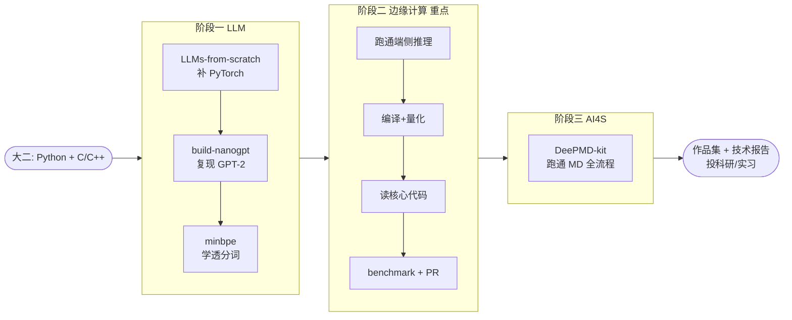

# AI 科研 / 实习项目复现学习路线

> 面向：计算机大二，有 **Python + C/C++** 基础，**PyTorch / 深度学习框架尚未上手**。
> 目标：用 GitHub 上口碑最好的项目，做有产出的复现，积累能写进简历的科研 / 实习经历。

## 选品逻辑

1. **先补 PyTorch 实战**——这是你现在最缺的，第一阶段用最适合新手的项目迈过去。
2. **放大 C/C++ 优势**——这是大多数学 AI 的同学不具备的稀缺能力，第二阶段重点投「边缘计算 / 推理引擎 / AI 系统」做差异化。
3. **切入科研方向**——AI4S 选文档完善、能端到端跑通的标杆项目，避免一上来啃论文劝退。
4. **原则**：每个项目都要「亲手跑通 + 产出一个可展示的东西（demo / benchmark / PR / 笔记）」，否则不算经历。

## 三阶段总览

| 阶段 | 方向 | 主线项目 | 周期 | 产出 |
|------|------|----------|------|------|
| [阶段一](phase1-llm/GUIDE.md) | 大模型 / LLM | `rasbt/LLMs-from-scratch` + `karpathy/build-nanogpt` + `karpathy/minbpe` | 3-4 周 | 手写并训练 GPT 小模型 + 复现笔记 |
| [阶段二](phase2-edge/GUIDE.md) | 边缘计算（重点）| `ggml-org/llama.cpp` | 4-6 周 | 端侧量化部署 demo + 性能 benchmark +（可选）开源 PR |
| [阶段三](phase3-ai4s/GUIDE.md) | AI for Science | `deepmodeling/deepmd-kit`（备选 `deepchem/deepchem`）| 4-6 周 | 机器学习势函数 / 属性预测实验 + 实验报告 |



## 快速开始

```bash
# 0. 先跑无需任何依赖的自检 demo，确认基础环境 OK（不联网也能跑）
python3 demos/self_attention_stdlib.py

# 1. 搭建环境（创建虚拟环境 + 安装依赖 + 跑自检 demo）
bash scripts/setup_env.sh

# 2. 克隆三个阶段需要的开源仓库到 external/（不纳入本仓库版本管理）
bash scripts/clone_repos.sh
```

> **环境注意事项（重要）**
> - 本机默认 Python 是 **3.14**。`numpy`、`torch 2.12.0` 等依赖**已安装并验证可用**（两个 demo 都能跑）。
> - **国内网络关键经验**：直连 PyPI 装大包（如 torch ~88MB）极易 `IncompleteRead` 中断；**换清华镜像一次就成**。`setup_env.sh` 已默认使用清华源。手动装包也建议加：
>   `pip install -i https://pypi.tuna.tsinghua.edu.cn/simple <包名>`
> - `demos/self_attention_stdlib.py` 纯标准库实现，无需联网即可运行；`demos/self_attention_numpy.py` 是 numpy 对照版。
> - 三个阶段一仓库（`LLMs-from-scratch` / `build-nanogpt` / `minbpe`）**已克隆到 `external/`**，可直接开始阶段一。
> - 阶段二/三要克隆的 `llama.cpp`、`deepmd-kit` 较大，若 GitHub 慢可加镜像前缀，如 `https://gh-proxy.com/https://github.com/...`。

## 目录结构

```
ai-research-roadmap/
├── README.md                 # 本文件：总路线图
├── requirements.txt          # Python 依赖
├── scripts/
│   ├── setup_env.sh          # 一键搭环境 + 自检
│   └── clone_repos.sh        # 克隆三阶段开源仓库
├── demos/
│   └── self_attention_numpy.py  # 纯 numpy 自注意力，验证环境/理解原理
├── phase1-llm/               # 阶段一：LLM / PyTorch 入门
│   ├── GUIDE.md              # 逐步复现指南
│   └── notes/                # 复现笔记模板
├── phase2-edge/              # 阶段二：边缘计算（重点）
│   ├── GUIDE.md
│   └── benchmark/            # 量化 benchmark 模板与脚本
├── phase3-ai4s/              # 阶段三：AI for Science
│   └── GUIDE.md
└── portfolio/                # 作品集：简历 / 技术报告 / 求导师模板
    ├── 技术报告模板.md
    ├── 简历项目描述模板.md
    └── 联系导师邮件模板.md
```

## 怎么把它变成「经历」

- 每个项目都 fork 到自己 GitHub，按 [portfolio/fork-README模板](portfolio/技术报告模板.md) 记录改动与理解。
- 阶段二的 benchmark、阶段三的实验整理成 [一页技术报告](portfolio/技术报告模板.md)。
- 投实习 / 联系科研导师时，用 [简历项目描述模板](portfolio/简历项目描述模板.md) 和 [邮件模板](portfolio/联系导师邮件模板.md)。

## 学习建议

- **不要追求全部读懂再动手**：先跑通 → 改一点 → 看效果 → 再回头理解，循环推进。
- **每天写一句话日志**：今天跑了什么、卡在哪、怎么解决的。这就是日后写报告的素材。
- **重点押注阶段二**：端侧推理 + C/C++ 是你的护城河，建议投入最多时间，简历主打这个。
